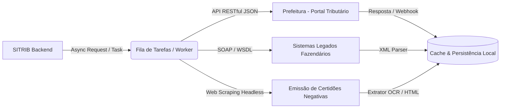

# Integração Segura com os Serviços da Prefeitura (SITRIB)

**Responsável técnico:** Adriel Morais (Product Owner / Desenvolvedor)  
**Projeto:** Sistema Integrado de Gestão Tributária (SITRIB) — Projeto Integrador UFT  
**Módulo:** Comunicação Externa, Segurança e Auditoria

---

## 1. Arquitetura de Busca e Ingestão de Dados

O SITRIB foi concebido para interagir de forma robusta e resiliente com os sistemas legados e modernos da Secretaria de Finanças e órgãos governamentais conveniados (Receita Federal, Detran-TO e Cartórios de Registro de Imóveis).

### 1.1. Comunicação Assíncrona e Não Bloqueante
Para evitar gargalos de I/O e assegurar que a interface do usuário permaneça responsiva durante consultas pesadas, a comunicação externa adota o modelo assíncrono:
* **Requisições Não Bloqueantes:** Emprego de bibliotecas assíncronas (como `asyncio` e `aiohttp`) para disparo paralelo de consultas cadastrais e certidões.
* **Mecanismo de Retentativa com Recuo Exponencial (*Exponential Backoff*):** Caso o endpoint municipal apresente instabilidade (códigos HTTP 429, 502 ou 503), o sistema realiza até 3 retentativas automáticas com intervalos crescentes (ex.: 2s, 4s, 8s).
* **Módulos de Web Scraping Resilientes:** Para serviços municipais que não dispõem de API REST aberta (como emissão de Certidão Negativa de Débitos — CND), utiliza-se web scraping controlado com emulação de sessão, parsing sanitizado e timeout estrito (máximo 15 segundos).
* **Camada de Cache Transitório:** Resultados de consultas frequentes (como tabelas de alíquotas e dados cadastrais básicos) são armazenados em cache local de curta duração (TTL configurável), diminuindo a carga sobre a infraestrutura da prefeitura.

---

## 2. Camada de Segurança e Conformidade com a LGPD

A integridade e o sigilo dos dados tributários do cidadão e das empresas são garantidos por meio de uma arquitetura de segurança em múltiplas camadas:

### 2.1. Criptografia em Trânsito (HTTPS / TLS 1.3)
* Todo o tráfego entre o SITRIB, os clientes e os servidores municipais ocorre exclusivamente sobre canal criptografado via **HTTPS** com **TLS 1.3**.
* Certificados digitais com algoritmo SHA-256 e suporte a *HSTS (HTTP Strict Transport Security)*, impedindo ataques de interceptação (*Man-in-the-Middle*).

### 2.2. Autenticação e Autorização Granular
* **Tokens JWT (JSON Web Tokens):** Sessões autenticadas utilizam tokens assinados criptograficamente com algoritmo HMAC-SHA256 ou RSA, contendo prazo de expiração curto (*exp*) e escopos de acesso definidos (*claims*).
* **API Keys Institucionais:** A comunicação entre o backend do SITRIB e os microserviços da prefeitura emprega chaves de API de alta entropia transmitidas em headers protegidos (`X-Api-Key` ou `Authorization: Bearer`).
* **Controle de Acesso Baseado em Perfis (RBAC):** Restrição estrita de visualização — usuários com perfil "Consulta" não acessam rotas de execução fiscal ou recálculo de alíquotas.

### 2.3. Limitação de Taxa (*Rate-Limiting*)
* Implementação do algoritmo de *Token Bucket* / *Leaky Bucket* na borda do sistema para restringir a quantidade de requisições por IP/usuário (ex.: limite de 60 requisições por minuto por chave de autenticação).
* Protege a API municipal contra ataques de negação de serviço (*DDoS*) e sobrecarga computacional acidental.

### 2.4. Mascaramento de Dados e Conformidade com a LGPD (Lei nº 13.709/2018)
* **Mascaramento em Telas e Relatórios:** Identificadores pessoais são anonimizados para perfis que não necessitam da visualização completa:
  * **CPF:** `***.456.789-**`
  * **Telefone:** `(63) 9****-2030`
  * **E-mail:** `c***a@email.com`
* **Logs Sanitizados:** Fica terminantemente proibido o registro de senhas, credenciais bancárias ou documentos completos em arquivos de log do sistema (`logging`).
* **Trilha de Auditoria Imutável:** Cada consulta de débito ou visualização de ficha cadastral gera um registro de auditoria contendo: ID do operador, timestamp ISO-8601, endereço IP e identificador da transação consultada.

---

## 3. Justificativa da Organização Modular e Desacoplada

A arquitetura de software adotada para a Sprint 2 foi estruturada sob o princípio da responsabilidade única e baixo acoplamento (*Separation of Concerns*):

1. **Desbloqueio de Paralelismo na Equipe:**
   * A separação entre **massa de dados/seeds (`seeds/`)**, **camada de validação/busca (`src/services/`)**, **algoritmos de apoio (`src/fila_cobranca.py`, `src/tabela_hash.py`, `src/grafo.py`)** e **persistência/banco (a cargo de Rayssa)** permite que cada desenvolvedor avance sem depender do término imediato do outro.
2. **Ambiente de Testes Plug-and-Play:**
   * O módulo `seeds/mock_data.py` e a suíte `tests/test_busca_validacao.py` foram desenvolvidos como uma "luva": funcionam perfeitamente em modo simulado em memória hoje e aceitam as classes ORM/SQLAlchemy da Rayssa via injeção de dependência (`executar_seed(model_registry)`), sem necessidade de reescrever lógica de negócio.
3. **Facilidade de Manutenção e Auditoria:**
   * Qualquer alteração futura nos contratos da prefeitura (mudança de endpoint, novos tributos ou novas exigências de segurança da LGPD) fica restrita ao serviço de busca e integração, sem afetar o cálculo de tributos ou a interface gráfica do sistema.
